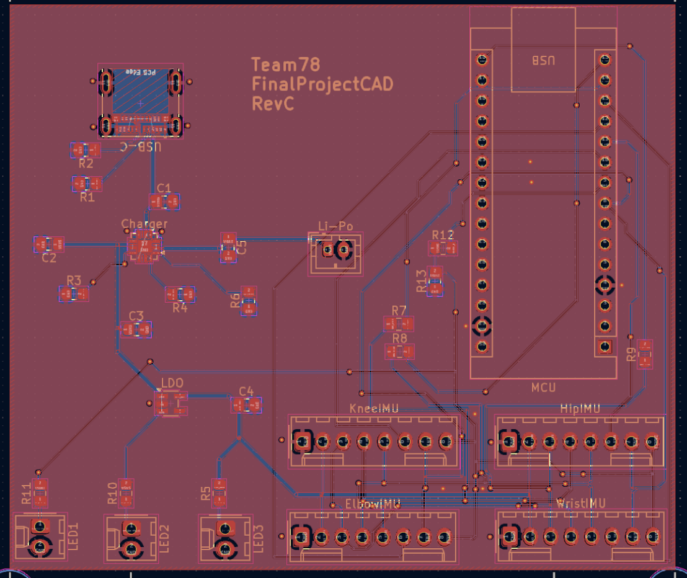
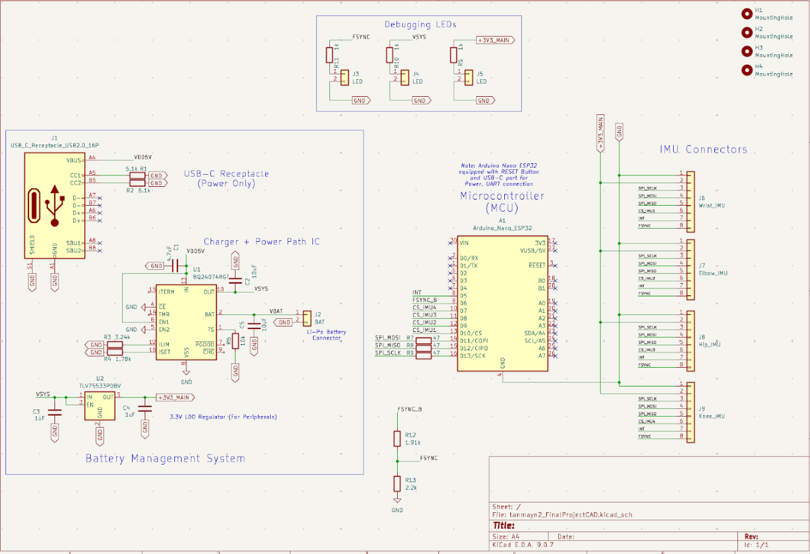
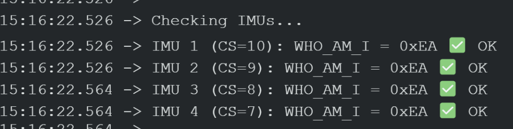
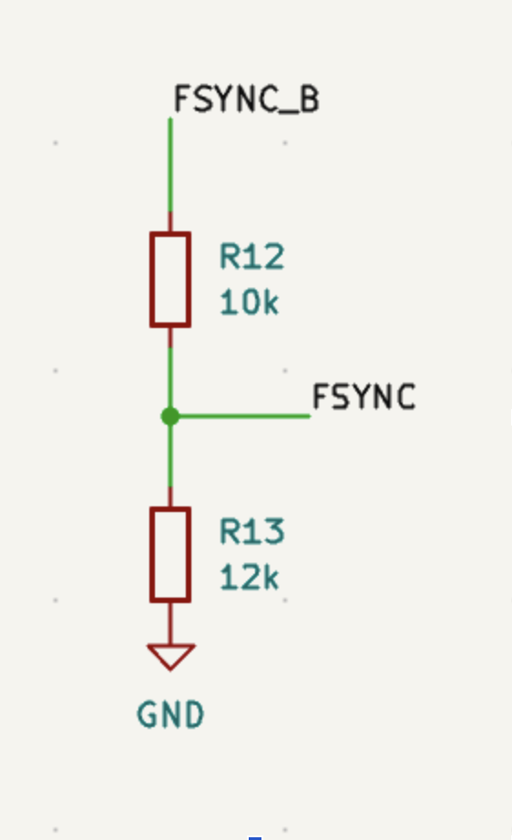
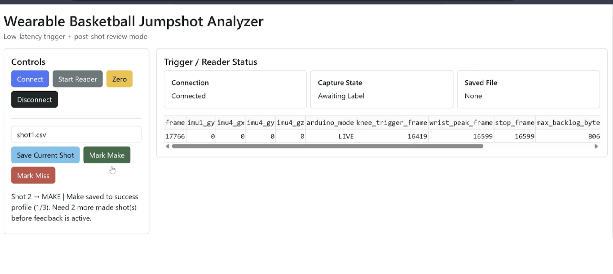
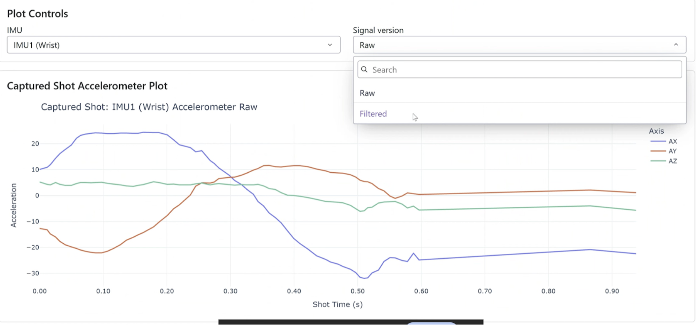
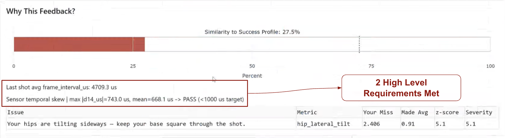
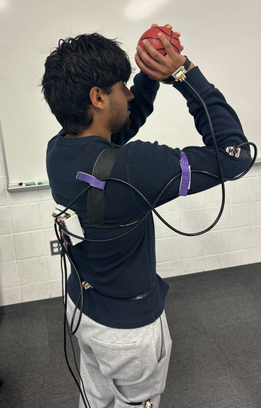
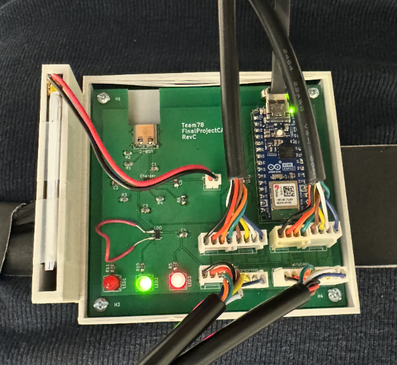

# Aiden Zack Lab Notebook Worklog

## Table of Contents
- [2/17-2/19](#217-219)
- [2/20](#220)
- [2/25](#225)
- [2/26](#226)
- [3/7](#37)
- [3/8](#38)
- [3/10 - Breadboard Demo](#310---breadboard-demo)
- [3/16 - Spring break](#316---spring-break)
- [3/23](#323)
- [3/24](#324)
- [3/25](#325)
- [3/30](#330)
- [4/2](#42)
- [4/3](#43)
- [4/7 - Progress Demo](#47---progress-demo)
- [4/13](#413)
- [4/14](#414)
- [4/15](#415)
- [4/18](#418)
- [4/19](#419)
- [4/21 - Mock Demo](#421---mock-demo)
- [4/22](#422)
- [4/23](#423)
- [4/24](#424)
- [4/26](#426)
- [4/27](#427)
- [4/28 - Final Demo](#428---final-demo)

## 2/17-2/19
### Objective - PCB Schematic
- Met all of these days to discuss parts, design choices, and how to set up schematic/PCB. The other members were more comfortable with the design, so a lot of the design was mainly with them, while my main focus later in the project would be the software side of our project. I am comfortable with KiCad, so I helped with setting the schematic/PCB up.

## 2/20
### Objective - PCB Review
- Met with TAs to discuss PCB, they stated how it might not be allowed to have full microcontroller on PCB, we plan to ask TA later.

## 2/25
### Objective - Design Doc, PCB
- Met to work on design document and discussed a lot of what we have planned for our project. Did some last minute changes of PCB/ started getting it ready to be able to be ordered.

## 2/26
### Objective - Order PCB
- Ordered PCB
- Worked on the the rest of the design document by ourselves, finished it up, and submitted a day before the deadline.

## 3/7
### Objective - Wire IMUs and Microcontroller on Breadboard
- Today we finished setting everything up on the breadboard and wired everything together. We used online tools for the location of different pins, such as GPIO, or SPI bus pins. We also began writing some simple Arduino code for the microcontroller.

## 3/8
### Objective - Arduino Code
- Finished writing all of the Arduino code and was able to get communication with the IMUs. Had tests verifying the WHOAMI register and was able to move the IMUs on the breadboard and see the data change together through the serial monitor.

## 3/10 - Breadboard Demo
### Objective - Showcase IMU Communication with Microcontroller
- Showed the Professor simple communication with IMU and microcontroller and showed timing differences

## 3/16 - Spring break
### Objective
- This week was spring break, so we did not meet or discuss our project at all.

## 3/23
### Objective - Plan PCB Soldering
- PCB order came in, but we decided to start working on it tomorrow after our weekly meeting with TA.

## 3/24
### Objective - Begin soldering
- Collected our parts from our TA, and began the soldering process. We all worked together here, and switched off some points with soldering. Only soldered the small parts, such as resistors, capacitors, and LED.

## 3/25
### Objective - Stencil PCB
- We continued soldering the PCB, but realized that some parts are very difficult or almost impossible to do with hand soldering. We talked to a different TA during office hours where they told us about the stencil, so we began placing another order for the fourth round with the PCB and waited.

## 4/2
### Objective - Begin Spyder Implementation
- When working on the breadboard for 4 IMUs, I realized by looking at different pin sheets, that the IMU needed 1.8 V instead of the 3.3 V for fsync. The IMU already had internal step down logic, but not for fsync. To counter this, we looked into either using resistors or another regulator, but the resistors is the easier option so we went with that. To get 3.3 to 1.8, it would be 10k for the top one and 12k for the bottom one. At this point, our group had figured out all 4 IMUs and fsync, but now we wanted to show the data better. Tanmay had previously used Spyder so we decided to go with that. Today, we were able to get pyserial working here, which proved that we were able to transfer the data from Arduino IDE to Python.

## 4/3
### Objective - Order PCB and Finish Spyder
- We realized that our USB-C was flipped on our microcontroller, meaning that it faced towards our IMU connectors rather than the outside of board, so we ordered a new PCB on our own, since all 4 rounds were finished.
- We needed more to show for our upcoming progress demo, so we decided to add saving windows of data, and plotting the correlated IMU data, either gyroscope or accelerometer. We were also able to prove fsync, since all IMUs are on the board and move the same, the graphs showed the same results showing how they are all synchronized.

## 4/7 - Progress Demo
### Objective - Show Simple Plotting, More Software, FSYNC, and 4 IMUs
- Met briefly an hour before to double check everything. Showcased our lengthened Python side with Spyder, which included plotting of IMU data by having a start and end time for collecting data. Added fsync into the IMUs and added 2 more compared to last breadboard demo. The biggest upgrade to this was our software side, which the professor has stated that was his biggest key for our project since the hardware is simpler.

## 4/13
### Objective - Begin Final PCB
- Our ordered PCB with all the final changes came in so me and Tanmay met to begin the solder process. For our first round PCB, we ordered extra resistors and capacitors so we used that and also took off from old PCB that we soldered if we needed more. However, we realized we still needed more, so we emailed TA to get them for tomorrow.

## 4/14
### Objective - PCB and CAD
- The biggest objective of this day was to make a lot of progress with the PCB. We finally figured out how to use the soldering oven, which made the soldering process a lot easier. It was mainly Arjun and Tanmay doing this part, which I was tasked with figuring out the 3D printing of both our enclosure for PCB and our parts for holding the IMU. I began by printing just the IMU, however the orientation was weird so there was a lot of stuck filament in the middle.

## 4/15
### Objective - Finish CAD and PCB
- The goal of this day was for the others to finish soldering the PCB/improve the wiring, while I was to finish the CAD printing. I switched the orientation of the IMUs which came out a lot nicer and then printed the PCB enclosure which came out really well.
- While waiting for the CAD designs to print, I began researching other ways to improve the readability and visualization of our product. I found Dash and Plotly, which was an easy way to set up a UI and showcase live plots changing. The goal of the next time was to transfer the Spyder code to Dash with the updated UI.

## 4/18
### Objective - Simple UI
- Now that we found how to showcase our product and feedback, I had to begin transferring everything over and switch to Plotly. A lot of the code was easy to transfer, since it was using similar tools such as pyserial with reading the Arduino code. However, this was my first time using Dash, so I had to do a lot of research in how to build the UI. I was able to build a simple UI that would hold all the same plots as the Spyder, and still able to have the data transferred from Arduino IDE.

## 4/19
### Objective - Shot Detection
- At this point the PCB has been fully soldered by my other group members and they tested it thoroughly, which we knew that it worked properly. We had simple wiring set up too, so our next step before the mock demo was to begin shot detection and keep feedback for the week after. After connecting up a person, we gathered data to find threshold for both the knee and wrist trigger. We were able to find the two triggers that would happen with our knee dip and wrist flick. After that, I was able to set up a make shot or miss shot button through Dash and was able to save the data around the kinetic chain of the jumpshot, with showing the plots of IMU data. We noticed that there was a lot of noise too, so I set up simple filtering and added plots for that.

## 4/21 - Mock Demo
### Objective - Progress Update with TA
- For the mock demo, we had our UI already set up with Dash and Plotly, however, we were only able to show shot detection and extraction (saving the data around the kinetic chain of the jumpshot). TA was worried about how we are going to implement all of the feedback, so after the mock demo we discussed our ideas for the feedback, which would mainly be my role to do and the focus of the next week.
- Our plan for the next week was to fix all the wiring issues, mainly with adding connectors that group all wires together so that the wires aren't loose and easily come out. Another issue is that the wires touched each other which would make the whole system have errors. By adding the group connectors, it would eliminate both of these errors.

## 4/22
### Objective - Begin Feedback System
- The goal of today was to begin implementing the feedback system with what we previously talked about as a group. I designed the data structures that would be able to hold all of the data, specifically from each IMU. I decided to store all of the data rather than just the peaks, as timing and other aspects of the jumpshot are important to our feedback. On top of that, our idea for feedback was that we wanted to give advice such as flick wrist more, so we have to keep all IMUs separate. I used Python lists to keep the data since that is the easiest. 

## 4/23
### Objective - Success Profile
- Now that we have a system for feedback, we need to have the success profile to compare the missed shots to. From before we already had the user saving each shot as a make or miss, but now we need to save the makes. Again, the success profile was saved in a list, with each shot having arrays of data that we could use to compare the misses. Also added a simple feedback system (mainly just printing at first) to ensure that it would only give feedback back to the user when there is enough shots in the success profile.
- Fully implemented the feedback, used time difference (t_2 - t_1) for timing inconsistencies between shots, and used Euclidean norm of the gyroscope data to be able to have the angular velocity. These are the two most important parts of our feedback system that we wanted to focus on.

## 4/24
### Objective - Similarity Score
- As a group we wanted to start preparing for the final demo, which we started by looking at our high level requirements. We noticed that we were above the 5ms mark for event detection, which we needed to make our system more efficient. Since we only needed the knee data to start saving the data, I decided to only have the knee data come in before a knee peak. This would be called our live mode, which is a lightweight version of taking in all of the data. Once the knee trigger occurs, then we would start collecting all of the IMU data in our full mode. Once the shot ends, then we go back to live mode.
- An idea that I had would be to have a full similarity score, which would compare each metric we had and give an overall percentage. For now, we only took the main feedback and used that as the similarity score rather than all of the metrics.
- Before we only gave back the largest feedback advice, but now added to where it would give feedback of all metrics that exceeded baseline. Also added another spot farther down in UI showing more detailed feedback system, rather than the one line.

## 4/26
### Objective - Updated Similarity Score
- The biggest change I had today was updating the similarity score. Instead of the one metric, I now added the similarity score to be based on all metrics, which with testing showed our similarity score to generally increase a lot compared to before.
- I also added a bar in the UI which would show the similarity score with the percentage above, which was for a better visualization for the user.

## 4/27
### Objective - Last Minute Fixes Before Demo
- As a group we met briefly to fix any UI issues and to take a video of our demo. Our high level requirements included frame interval of shots and temporal skew, which we also added to the UI for easier showing during the demo.
- Before to situate the wires more on our body, we used bandage wrap around shoulder and upper arm, as we needed it to be more secure when doing full motions of shooting with the arm. One of the grades for the final demo is packaging, which we wanted it to look more professional, so I helped with wiring and placing of Velcro straps around the arm/shoulder.

## 4/28 - Final Demo
### Objective - Showcase Project to Prof
- As a group we met briefly in the morning to ensure that we had no loose wiring, and everything worked as normal. We hooked up Arjun and everything went smoothly. We also did some last minute fixes to our wiring, specifically with setting up the wires along the arms/shoulder to ensure that the wire does not get in the way of the user.
- Did the final demo with everything going smoothly.
